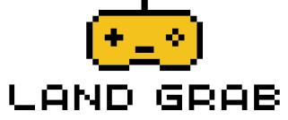

    

[Watch the demo](https://www.youtube.com/watch?v=enUUbIkUhHw)

## Game Description
Land Grab is a **3 player** grid based game where players will have to compete against one another by claiming the region with the most cells. Each game, the gameboard is randomized and divided into three distinct regions, each with a different amount of cells. Once the round starts, players must rush to choose a region to claim. Once a region is claimed, it becomes locked, which then prevents other players from selecting it. When everyone has made their selection or time runs out the game will then choose the winner by selecting the player with the largest region. 

⚠️ NOTE: If one or more players do not choose a region in time, the round will reset! ⚠️ 

## Technology Stack
This Project was developed using the following technologies!
- **Programming Language**: Python
- **Other Tools**: Pygame
## Requirements
- Have 3 friends or strangers (including you)
- Have Python and Pygame installed on your current machine! :D
- If you want to be able to host the game online (People not on the same network as you). You will need to portforward it to your IP address.
## Installation
1. Clone the repository  
2. Open repository folder on Visual Studio Code or other text editors.  
3. To start the server:  
    - Open a terminal or command prompt in the project directory.  
    - Run the following command:  
      `python server.py`  
      ⚠️ NOTE: Only one person needs to run the server. If someone else is already hosting it, you can skip this step. ⚠️  
4. To join the server:  
    - Open a terminal or command prompt in the project directory.  
    - Run the following command:  
      `python client.py`
